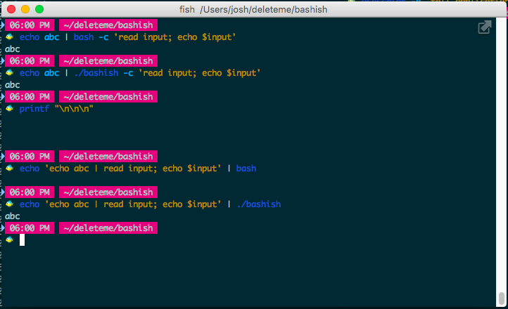
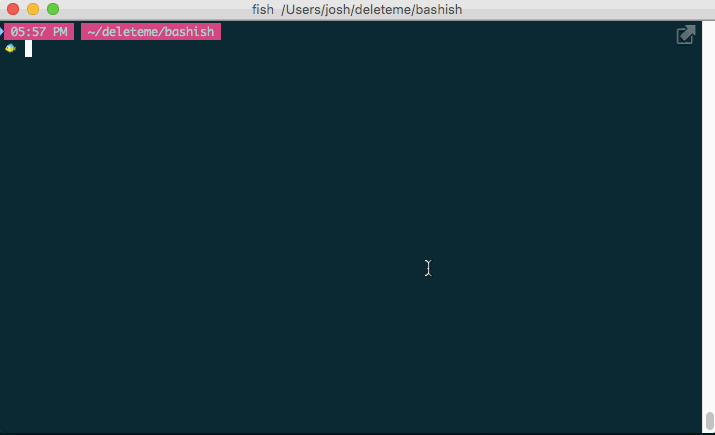

How bash should have done builtins
==================================

Bash's builtins should not be run in a subprocess, because it leads to nonsense like this:


```sh
$ echo abc | bash -c 'read input; echo $input'
abc

$ echo 'echo abc | read input; echo $input' | bash

```

Why does the second one not work? Because `read input` is in a pipeline,
so it is run in a subprocess (at least, that's how I understand it, I'm not sure how to prove this).

Why does it run in a subprocess? I assume so that it can have its own stdin / stdout / stderr.

But that's absurd, it doesn't need to spawn a process to use those, this is a symptom of bad practices:
they must be using their file descriptors globally instead of passing them as arguments, so to change
what they print to, they have to change the process itself, so they have to run in a subshell...

Here I have written `bashish`, a proof of concept that builtins do not need to run in a subshell,
they just need to have stdin injected:

```sh
$ echo abc | ./bashish -c 'read input; echo $input'
abc

$ echo 'echo abc | read input; echo $input' | ./bashish
abc
```

Take a look:



Surprisingly, it has mediocre interactive support, as well:


